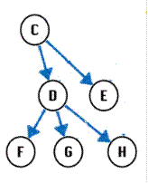
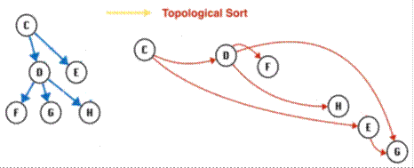

# Architecture

The schema alteration consists of two phases

1 - Find all tables, sprocs, functions, triggers, user-defined table type that need to be modified.

This phase consists of four steps:
* All tables containing columns with matching names are identified. 
* All other tables containing columns with foreign key references to columns found in the previous step are identified using sql queries against database.
* All  stored procedures, functions and triggers containing references to the columns identified in the previous steps are found by running sql queries against database.
* All user-defined table types containing columns with matching names are found.

2 - Modify tables, sprocs, functions, triggers and user-defined table type.

For each column that needs to be modified, the following constraints are found by executing sql queries against the database:
* Foreign keys
* Primary key
* Unique
* Default
* Check
* Statistics
* Index

A sql script is generated that drops the constraints, alters the column and adds the constraints. Columns with foreign key relationships need to be altered in the correct order of references. These relationships are represented by a directed acylic graph whose nodes are columns connected by foreign key relationships.

These columns are ordered using topological sort to get a linear ordering of vertices such that for every directed edge (u,v) vertex u comes before v in the ordering.

Altering tables in this order ensures that no column containing a foreign key reference to another column is altered before the relevant references are dropped.

Stored procedures, triggers and functions found in the first phase were modified by parsing their definitions to find variable declarations where variable names matched the regular expression supplied by the user and then updating the data type. To parse the definitions, we used Microsoft.SqlServer.TransactSql.ScriptDom, a .NET framework api that provides Microsoft SQL Server-specific (TSql) Parser support. By converting t-sql scripts into an Abstract Syntax Tree, the lexical/syntactical structure of the SQL code is revealed. We used a visitor to navigate the tree and parse statement types that were of interest and generated scripts with updated definitions containing the new data type for all matching variables.
